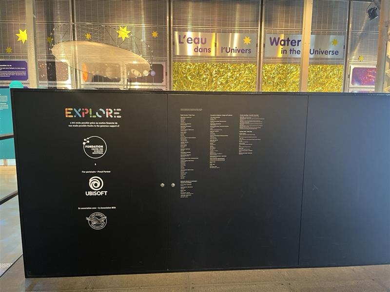
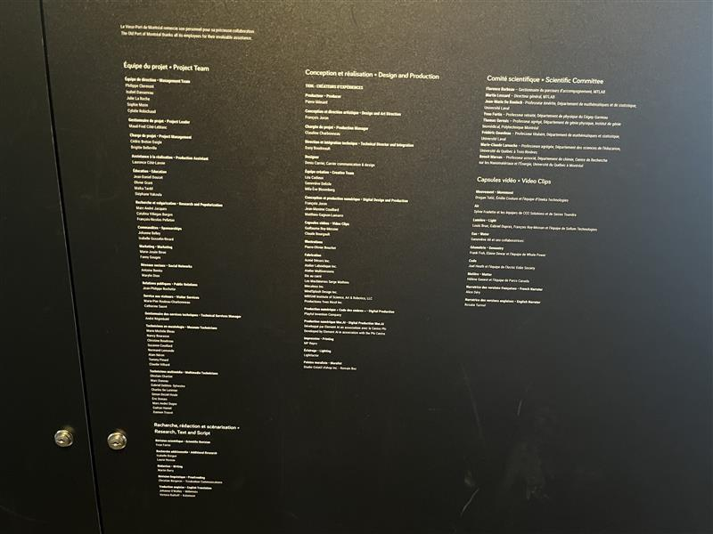
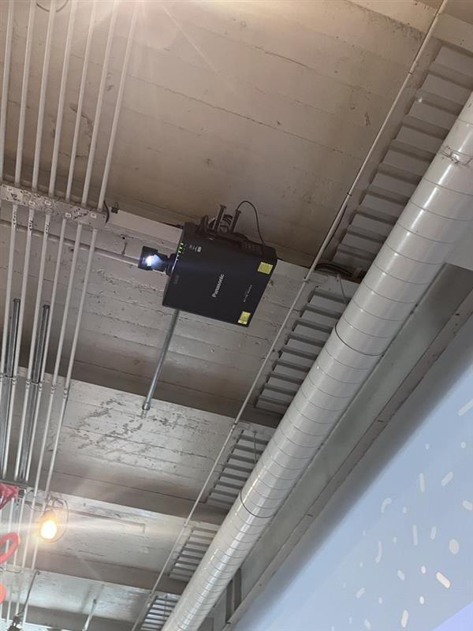
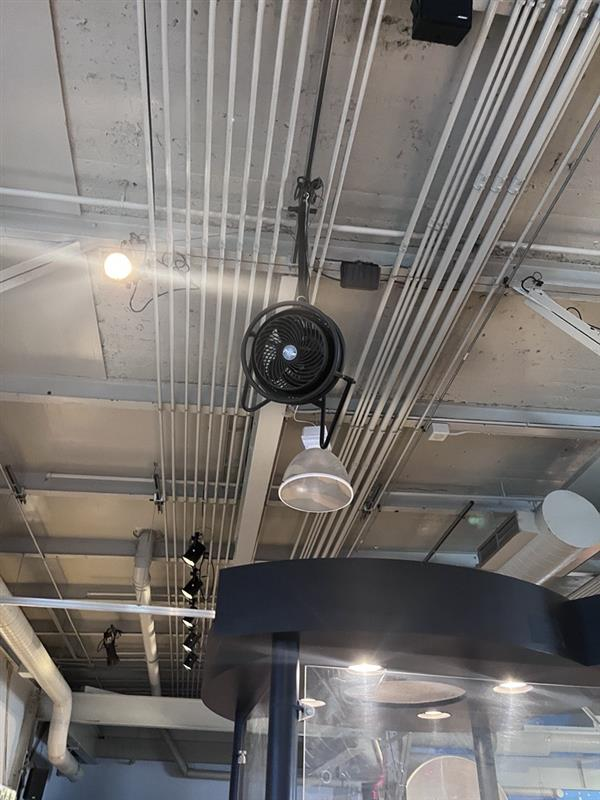
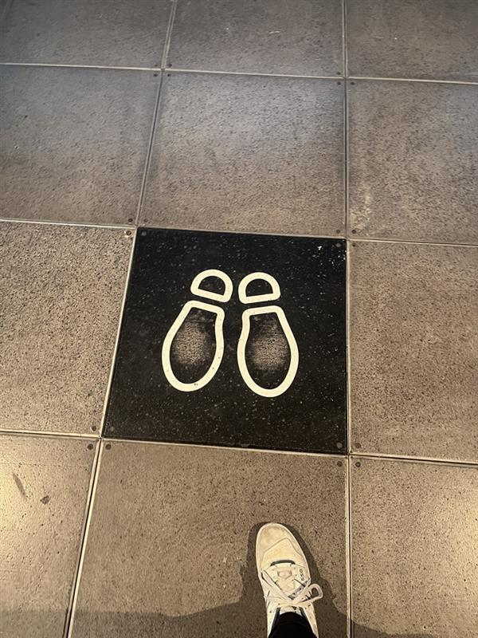
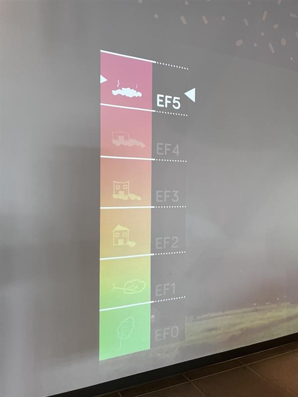

# Qui sème le vent... récolte de l'énergie

### Le centre des sciences positionnée au 2 Rue de la Commune O, Montréal, présente l'exposition explore.

 
 
 
              

# Description

Dans l'exposition des centres des sciences, réalisé par une grandes équipes d'ingénieurs, il y avait plusieurs oeuvres, mais une capte mon attention. Une oeuvre qui s'intitule "Qui sème le vent... récolte de l'énergie".Une ouevre qui demontre la puissance des vents aux participants de façon intéractive.
 
 
  
 
  
                  
   
- oeuvre temporaire
- visité le 17 avril 2024

## Composantes et éléments
L'œuvre comprend une plaque de pression qui détecte la présence du participant, déclenchant ainsi un ventilateur fixé au plafond. Au-dessus du participant, un projecteur projette une vidéo affichant les niveaux de puissance du vent devant lui. À mesure que le niveau de puissance augmente, le ventilateur accélère sa vitesse, produisant un flux d'air plus intense. Tant le ventilateur que le projecteur sont suspendus au plafond grâce à une tige métallique.

| Composante         |Photos |
| ------------- | ------------- |
| Projecteur  |  |
| ventilateur  | |
| Plaque de pression  |  |
| Projection |  |

## Expérience vécue et appréciation

Lorsque vous vous approchez du mur, vous remarquez immédiatement les traces de pas, incitant le participant à se positionner dessus. Au premier regard, le ventilateur passe souvent inaperçu, mais dès que vous marchez sur la plaque, il s'active, attirant votre attention et vous faisant réaliser que sa puissance varie en fonction du niveau affiché devant vous.

----

Ce qui m'a le plus intrigué, c'est l'effet de surprise lorsque nous posions notre pied sur la plaque, ressentant immédiatement le vent et comprenant alors le fonctionnement de l'œuvre. Cependant, contrairement aux autres œuvres de l'exposition, celle-ci m'a semblé devenir redondante après la première expérience, car elle offre une expérience similaire à chaque interaction.

 ## Source 
- Photographe : Mikael Arseneau
- Lieu : [Centre des sciences](https://www.centredessciencesdemontreal.com/)
