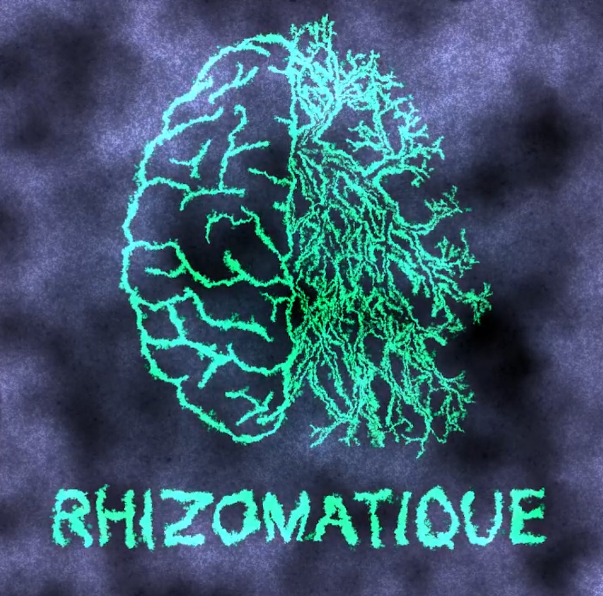
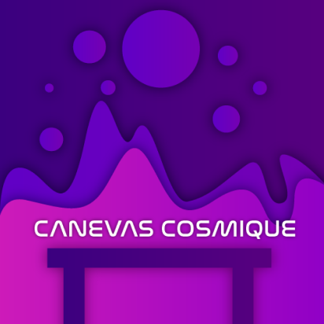

Crescentia, une exposition présentant les projets finaux des étudiants du programme TIM, à pour thème la croissance.

# Rhizomatique
Rhizomatique est une oeuvre intéractive conçu par 4 étudiants.
- Jolyanne Desjardins
- MaÏka Désy
- Laurie Houde
- Felix Testa Radovanovic

 
Selon mon humble avis, l'intention primaire des étudiants était la résurgence de souvenirs lointains. Ce qui répondrait à l'attente merveilleusement. En observant les vidéos descriptives du projets, mes sentiments initiales étaient l'incompréhension et l'incertitude. Lors de l'avant première, je fut étonné et plaisé de leur travail. Cependant, lors de l'ouverture, mes sentiemnts ont accrus et j'était époustouflé du résultat finale. Selon moi, les étudiants ont utilisés leurs connaisnaces acquises en audio, en programmation et en vidéo. L'utilisation de la kinect pour détecté les mains et igénieux me donne des idées pour mes projets futurs. À mon avis, Rhizomatique est positionné troisième dans les oeuvres de Crescentia.

 

 

 Lien vers le site : [Rhizomatique](https://tim-montmorency.com/2024/projets/Rhizomatique/docs/web/index.html)
 
       

# Effet-Papillon
Effet-Papillon est une installation intereactive immersive conçu par 6 étudiants
- Raphaël Dumont
- Alexis Bolduc
- William Morel
- Alexia (Ryan) Papanikolaou
- Viktor Zhuravlev
- Jasmine Lapierre
  
 
 À mon avis, le thème principal de l'œuvre était d'explorer le cycle de vie d'un pommier en effectuant des tâches physiques simples, en lien avec le sujet de Crescentia. Lorsque j'ai visionné les vidéos descriptives, j'ai été confus et désintéressé par leurs propositions. Lors de l'avant-première, mes sentiments ont été renforcés en observant les nombreux problèmes techniques de l'œuvre. Néanmoins, lors de l'ouverture, ces problèmes ont été résolus et l'œuvre s'est nettement améliorée. Pour réaliser le projet, les étudiants ont dû utiliser leurs connaissances en vidéo, audio et traitement audiovisuel. L'utilisation du transfert de données à travers était très intéressante. Cependant, je classe Effet-Papillon en dernier en raison de ses nombreux problèmes.

 

 
 
  Lien vers le site : [Effet-papillon](https://tim-montmorency.com/2024/projets/Effet-Papillon/docs/web/index.html)

         
  
 # Sonalux
 Sonalux est une installation intéractive conçu par 4 étudiants

 - Antoine Haddad
 - Camélie Laprise
 - Ghita Alaoui
 - Vincent Desjardins

 
À mes yeux, Sonalux visait à démontrer la croissance en contrôlant le volume, la vitesse et le tempo, ce qui s'inscrit dans le thème de la croissance. Lors du visionnage des vidéos, j'ai compris leurs idées, mais lors de l'avant-première, le projet n'était pas totalement terminé, donc je n'ai pas saisi toute l'étendue du projet. Cependant, lors de l'ouverture, de nombreux éléments ont été ajoutés, ce qui a facilité la compréhension du projet. Les connaissances acquises dans les cours de vidéo, audio et traitement audiovisuel ont été essentielles pour le travail. L'utilisation de la lumière pour afficher l'intensité du son était intéressante et m'a inspiré pour mes futurs projets. Cependant, Sonalux se classe quatrième en raison de son manque de rejouabilité.
  

 

 

  Lien vers le site : [Sonalux](https://tim-montmorency.com/2024/projets/Sonalux/docs/web/index.html)
 
         

# Canevas Cosmique
Canevas Cosmique est une installation intéractive conçu par 5 étudiants
- Jacob Alarie-Brousseau
- Étienne Charron
- Jérémy Cholette
- Quoc Huy Do
- Mikaël Tourangeau

 
À mon avis, Canevas Cosmique avait pour objectif de conférer au joueur un pouvoir, celui de contrôler une galaxie. Cependant, je ne vois pas vraiment le lien avec le thème de la croissance. Lors de l'avant-première, le projet était presque parfait, mais manquait de petits éléments pour le rendre meilleur. Cependant, lors de l'ouverture, les étudiants ont résolu tous les problèmes et ont facilité l'expérience utilisateur en transformant les codes QR en figurines. Les connaissances acquises en programmation, animation et traitement audiovisuel ont été essentielles pour le travail. L'utilisation de codes QR pour la détection d'éléments était ingénieuse et très innovante. Grâce à leur travail approfondi, je classe Canevas Cosmique deuxième dans l'exposition.

 

 

 Lien vers le site : [Canevas Cosmique](https://tim-montmorency.com/2024/projets/Canevas-Cosmique/docs/web/index.html)

 ## Source 
- Photographe : Mikael Arseneau
- Lieu : [Montmorency](https://www.cmontmorency.qc.ca/)

