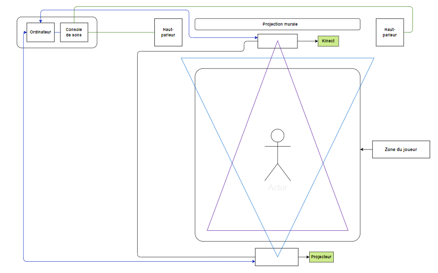

# Kigo

Kigo est une exposition temporaire présenté dans l'exposition Crescentia au Collège Montmorency.
- visité le 21 Février(avant-première)
- visité le 13 Mars(Ouevrture)

L'oeuvre a été conĉu par 5 étudiants du programme de la technique d'intégration multimédia en 2024
- Érick Ouellette
- William Rathier Mailly
- Gabriel Clerval
- Nicolas St-Martin
- Antoine Dion

Kigo est une œuvre interactive qui invite les participants à s'engager dans un jeu interactif où le joueur doit naviguer à travers des obstacles dans un univers inspiré d'un style néon rétro. Cette conception en fait une installation interactive captivante

| Description         |Photo |
| ------------- | ------------- |
| L'oeuvre est placé sur l'un des long murs du grand studio |  |

## Composantes
L'œuvre est mise en œuvre grâce à un Kinect, qui capte les mouvements des joueurs dans une zone de jeu, puis projette le jeu sur le mur devant le joueur à l'aide d'un projecteur. L'équipe a dû installer le Kinect, le projecteur, un ordinateur pour le logiciel, des haut-parleurs ainsi que tous les câbles nécessaires. Ensuite, ils ont fixé le projecteur et les haut-parleurs sur les rails déjà présents au plafond du grand studio.

| Composante         |Photos |
| ------------- | ------------- |
| Projecteur et haut-parleur |  |
| Kinect  | |
| Ordinateur  |  |
| Rail au plafond |  |

## Expérience vécu

Durant ma première visite, j'ai été agréablement surpris par le projet et j'ai immédiatement été séduit par l'idée du jeu. J'ai eu l'occasion d'échanger avec les étudiants responsables du développement, et j'ai partagé avec eux mes suggestions visant à rendre le jeu plus captivant. Lors de ma deuxième visite, j'ai constaté avec satisfaction que mes requêtes avaient été prises en compte, ce qui a contribué à rendre l'expérience de jeu encore plus enrichissante. Ce qui m'a particulièrement plu, c'est que contrairement aux autres oeuvres du Crescentia, Kigo se distingue par sa variété d'obstacles et d'événements, ce qui le rend facile à rejouer sans jamais devenir redondant. Personnellement, je ne modifierais rien et je tiens à conserver l'intégralité des idées pour mes projets futures.

 Lien vers le site : [Kigo](https://tim-montmorency.com/2024/projets/Kigo/docs/web/index.html)

## Source 
- Photographe : Mikael Arseneau
- Lieu : [Montmorency](https://www.cmontmorency.qc.ca/)

