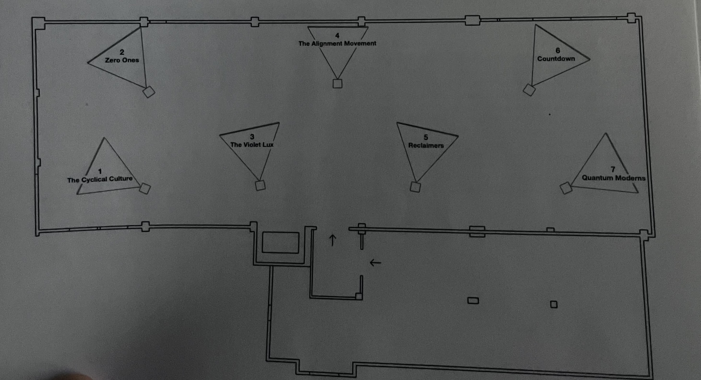

# Phase Shifting index
### La fonderie Darling positionné au 745 Rue Ottawa à Montreal, présente en ce moment l'oeuvre de Jeremy Shaw intitulé Phase Shifting Index.

  

 - oeuvre itinérante
 - visité le 31 janvier 2024
 

----
## Description

 
  
Phase Shifting Index realisé par Jeremy Shaw a traversé le monde commençant en France, au Centre Pompidou en 2020. Pour ensuite démenager en Allemagne, pour terminer son chemin au Canada à la Fonderie Darling de Montréal.

