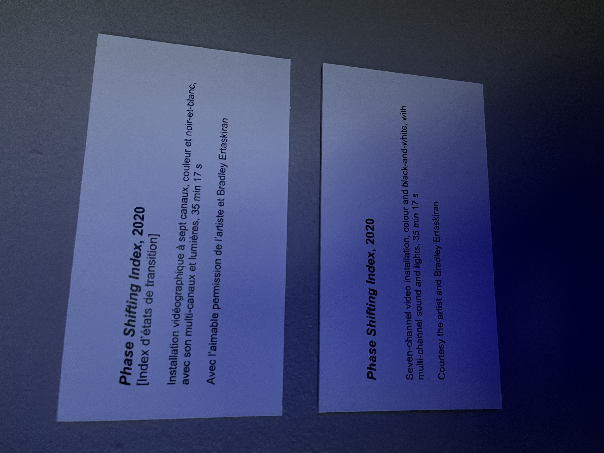

# Phase Shifting index
### La fonderie Darling positionné au 745 Rue Ottawa à Montreal, présente en ce moment l'oeuvre de Jeremy Shaw intitulé Phase Shifting Index.

  

 - oeuvre itinérante
 - visité le 31 janvier 2024
 

----
# Description

 

"Phase Shifting Index", réalisé par Jeremy Shaw, a parcouru le monde, débutant en France au Centre Pompidou en 2020. Ensuite, l'installation a déménagé en Allemagne avant de terminer son parcours au Canada, à la Fonderie Darling de Montréal.
  

 

 
L'œuvre consiste en 7 écrans dispersés dans la pièce, suspendus du plafond de manière à ce que tous les écrans soient visibles depuis les bancs dans l'installation.

                      

## Composantes et éléments
 

  
   
    
  
Pour présenter l'œuvre, la Fonderie Darling a d'abord dû recouvrir l'intégralité du plancher de tapis et créer des bancs sur le côté de l'entrée, également recouverts de tapis. Ensuite, ils ont installé des rails au plafond pour accrocher les écrans, maintenus avec des fils de fer, ainsi que des haut-parleurs et des projecteurs, maintenus avec des potences. De plus, ils ont fixé des lumières directement sur les rails au-dessus des estrades.

----

## Expérience vécue et appréciation
 

Lorsque vous entrez dans la pièce, vous remarquez immédiatement les 7 écrans, chacun présentant une vidéo différente de danse. Au fil du temps, les danses commencent à se ressembler de plus en plus et une musique de fond commence à se faire entendre. Lorsque la musique atteint son apogée, les 7 écrans clignotent en noir et blanc, tous présentant une danse commune. Ensuite, la musique change de rythme et les images commencent à subir des effets stroboscopiques de plus en plus intenses. Par la suite, tous les écrans affichent une sorte d'ADN différent sur chacun d'eux. Pour finir, les écrans s'éteignent tous simultanément, mettant fin à l'œuvre.

