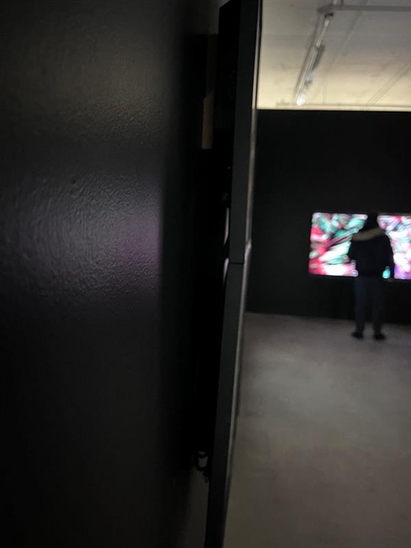

# Matière première

Matière première est une oeuvre conĉu par Yan Breuleux, un professeur agrégé à l'École NAD-UQAC UQAC (École des arts numériques, de l'animation et du design). L'oeuvre  été présenté au Galerie Elektra (5445 de Gaspé Avenue) du 18 janvier au 2 mars 2024.

- expostion temporaire
- visité le 1 mars 2024
          
  # Description

  
 
   
 

 Matière Première est une installation artistique composée de six télévisions diffusant des autoportraits de Yan Breleux, intégrés dans des environnements virtuels. Chaque œuvre animée a une durée variable, comprise entre 4 et 12 heures. En raison de la nature passive de la visualisation télévisuelle et de l'absence d'interaction, cette installation invite à la contemplation.

     

 # Composantes et éléments

 Pour présenter l'œuvre à la Galerie Elektra, un espace suffisamment spacieux dans le bâtiment a été réservé exclusivement pour elle. La galerie a ensuite été installé des murs noirs entourant la pièce ainsi que des télévisions pour afficher les œuvres. Yan Breleux, de son côté, a apporté les fichiers pour publier les œuvres sur les télévisions. La pièce ne comporte aucun haut-parleur, et rien n'est fixé au sol. Tous les fils électriques sont couverts par les murs noirs. En son centre, trône un petit canapé, invitant les spectateurs à s'asseoir et à contempler les œuvres. Les télévisions sont disposées de manière à ce que quatre soient du côté gauche, une devant et une à droite.
 
 
  
 
   
 
    
 
  
 
   
 

                                     
 # Epérience vécue

Quand vous entrez dans l'œuvre, vous êtes immédiatement frappé par les six écrans, mis en évidence par le contraste avec les murs noirs. Les changements dans les œuvres sont presque imperceptibles au début, mais dès que vous vous approchez, vous commencez à remarquer des modifications extrêmement subtiles.

----

Personnellement, je n'ai pas été pleinement satisfait par l'œuvre. Tout d'abord, le manque d'interactivité la rend rapidement ennuyeuse à mes yeux. Ensuite, les longues durées des vidéos, variant entre 4 et 12 heures, rendent difficile le fait de rester dans une petite pièce pendant de si longues périodes. À mon sens, une dimension interactive aurait pu rendre l'œuvre plus captivante en permettant aux spectateurs de modifier la durée de chaque vidéo, créant ainsi une expérience plus engageante et divertissante.
  
